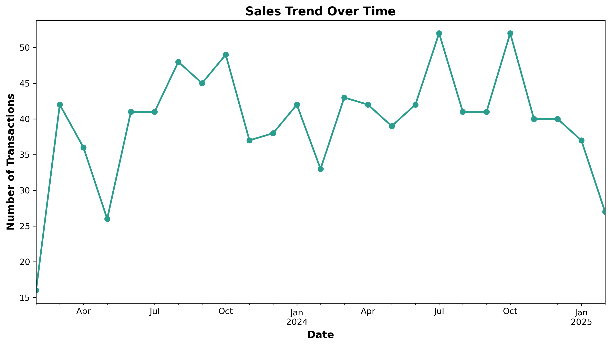
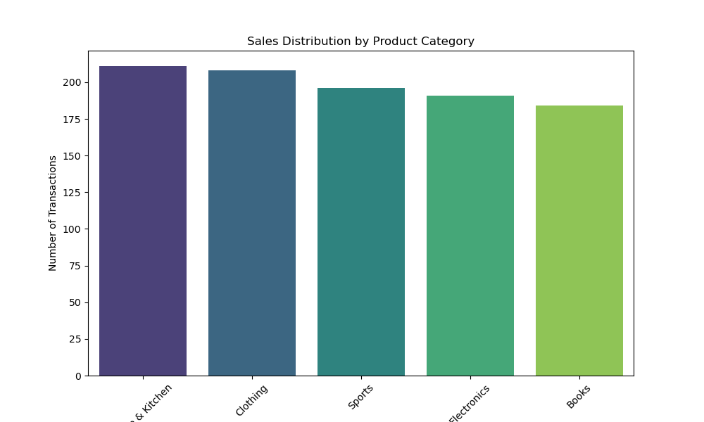
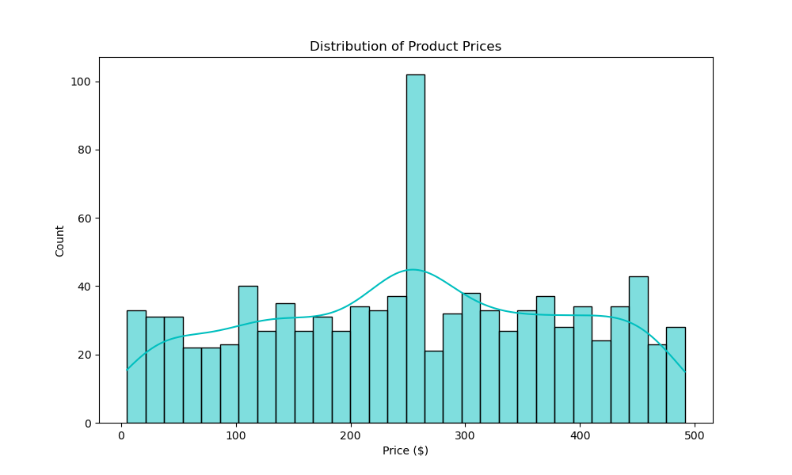
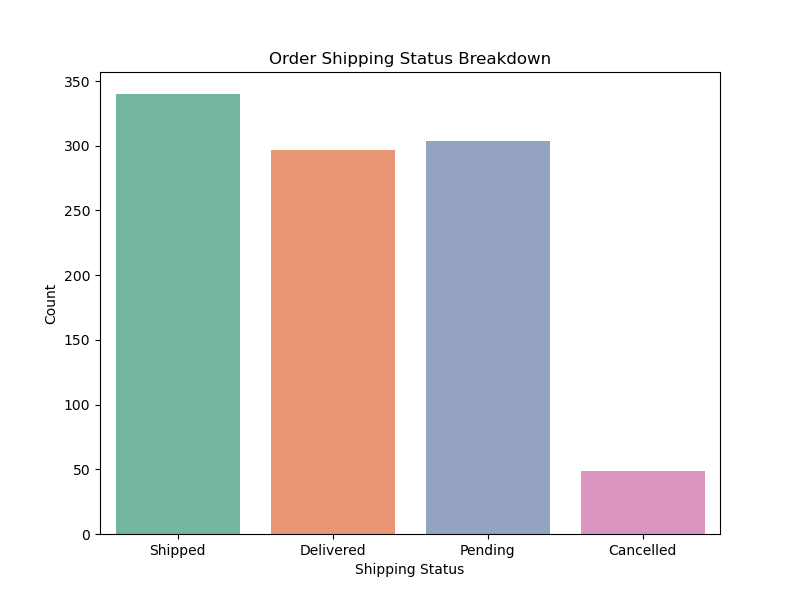
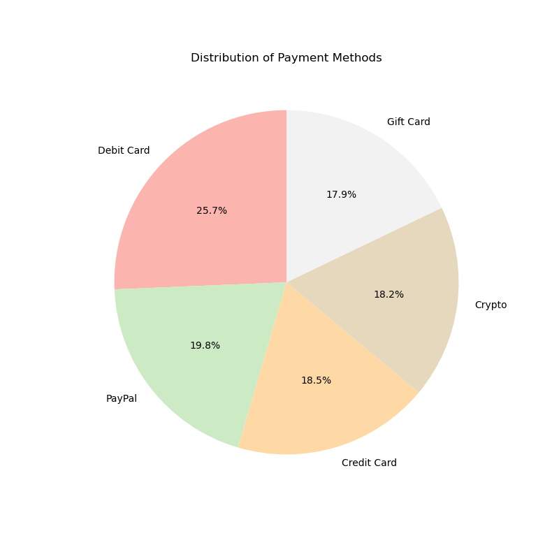

# E-Commerce Transactions Dataset

This project provides a synthetic dataset of e-commerce transactions, along with scripts and notebooks for data generation, cleaning, and visualization. It simulates real-world sales data to showcase data analysis and visualization techniques.

## Project Structure
```
ecom-transactions-dataset
├── data
│   ├── cleaned_ecom_transactions.csv
│   ├── ecom_transactions.csv
├── notebook
│   ├── data_cleaning.ipynb
│   ├── data_generation.ipynb
│   ├── data_visualization.ipynb
├── scripts
│   ├── data_cleaning.py
│   ├── data_generation.py
│   ├── data_visualization.py
├── visualizations
│   ├── payment_methods.png
│   ├── price_distribution.png
│   ├── sales_by_category.png
│   ├── sales_trend.png
│   ├── shipping_status.png
├── README.md
```

## Dataset Overview
The dataset contains 1,000 rows of simulated e-commerce transactions, including:
- **Transaction ID** (Unique identifier for each transaction)
- **Customer ID** (Unique identifier for each customer)
- **Transaction Date** (Date of purchase)
- **Product Category** (Category of purchased product)
- **Price** (Cost of the purchased product)
- **Quantity** (Number of items purchased)
- **Payment Method** (Payment method used by the customer)
- **Shipping Status** (Order status such as Shipped, Delivered, Cancelled)
- **Customer Rating** (Rating given by the customer, if available)

## Data Visualizations

### Sales Trend Over Time

**Interpretation:** This line chart shows the number of transactions per month. The trend provides insights into seasonality and fluctuations in e-commerce activity. Spikes may indicate promotional periods or holiday seasons, while dips may correspond to off-peak periods.

### Sales by Product Category

**Interpretation:** This chart shows the distribution of transactions across different product categories. Categories with higher transaction counts indicate popular product segments, which can help businesses focus their marketing efforts.

### Price Distribution

**Interpretation:** This histogram highlights the frequency of different price points in the dataset. A skewed distribution may suggest that certain price ranges are more common in transactions, influencing pricing strategies.

### Shipping Status Distribution

**Interpretation:** This chart presents the breakdown of shipping statuses. A high number of cancelled orders may indicate customer dissatisfaction or logistical issues, whereas a high rate of successful deliveries suggests smooth order fulfillment.

### Payment Method Distribution

**Interpretation:** This chart visualizes the popularity of different payment methods. Understanding payment preferences can help optimize checkout experiences and inform business decisions on which payment options to offer. The most used payment method is debit cards, while the least used is gift cards.

## How to Use
1. **Generate Data:** Run `scripts/data_generation.py` to create a synthetic dataset.
2. **Clean Data:** Use `scripts/data_cleaning.py` to preprocess the dataset.
3. **Visualize Data:** Run `scripts/data_visualization.py` to generate insights.
4. **Explore Notebooks:** Open `notebook/` to review detailed analysis steps.

## License
This project is open-source and can be freely used for learning and experimentation.
